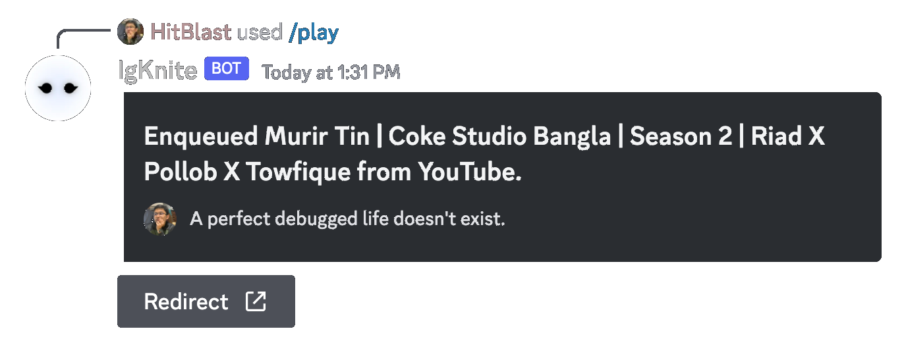

 

 

# IgKnite for Discord
### A Discord bot that focuses on interactivity and fluency when it comes to music and moderation.

 

  

  

 

## 🛠 Features

- Written with <3 in **pure Python.**
- Slash-first command handler and user interface.
- Asynchronous code on top of the [disnake](https://github.com/DisnakeDev/disnake) API wrapper.
- A playground all by itself for creative commands.
- Fully open-source (including assets).
- No buzz, all buff!

 

## 🔌 How to use?

In order to learn about everything; from adding IgKnite to your Discord server to using its commands to even self-hosting it on your machine, kindly visit [the official documentation page](https://igknitedev.github.io/docs) and have a go-through! 

 

## 🔖 License

This project has been licensed under the [MIT License](LICENSE).