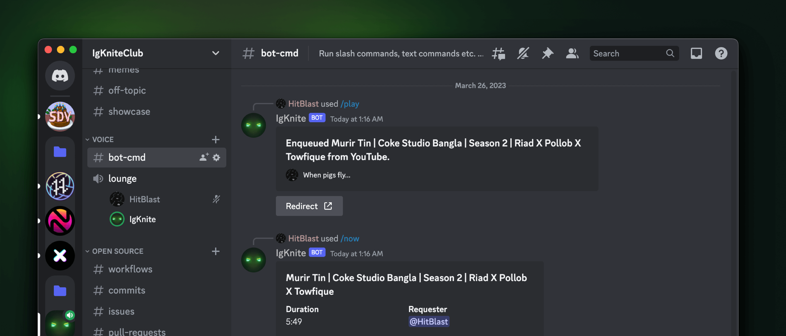

<!-- SPDX-License-Identifier: MIT -->

 

 

# IgKnite

 

  

---

🌟 Star the project if you like it! :D 🪄

## 📌 Table of Contents

- [Overview](#-overview)
- [Features](#️-features)
- [Usage](#-usage)
- [Contributing](#-contributing)

---

 

## ⚡ Overview

Most Discord bots available to the end-users nowadays are either built to be a jack-of-all-trades or are too specific to a particular niche. IgKnite is a Discord bot that aims to be the middle ground between these two extremes. It is a bot that is designed to be a playground for creative commands, while also providing a polished experience for moderation and music commands.

IgKnite is built on top of the [disnake](https://github.com/DisnakeDev/disnake) API wrapper for Discord, and is easily self-hostable to the point where you can easily run it on your local computer. The bot's codebase is asynchronous and easily extendable since it's made fully open-source.

## ⚔️ Features

- Battle-tested moderation commands for stable community moderation.
- Low-level & polished music system (YouTube + Spotify) for everyday use.
- Both developer and user friendly at once.
- Fully open-sourced with love (including assets!).
- No buzz, all buff!  

## 🔖 Usage

IgKnite has its own [documentation webpage](https://igknitedev.github.io/docs) where you can learn about everything, starting from the commands to even self-hosting the bot on your local computer.  

## 🔨 Contributing

If you'd like to add your own features to this project, consider having a look at the [contribution guidelines.](./.github/CONTRIBUTING.md) It contains all the critical information for you to hack and deploy! The official documentation for IgKnite, as hyperlinked in the previous section, also has similar text (possibly more) written within to help you understand the core functionalities of the project. We're eagerly waiting for your contribution! :D  

---