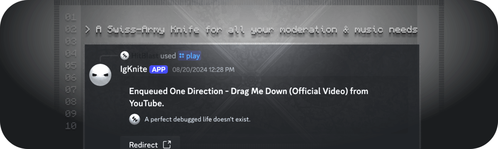

<!-- SPDX-License-Identifier: MIT -->

 

 

# IgKnite

  

---

## Table of Contents

- [Mission](#⚔️-our-mission)
- [Features](#🗡-features)
- [Usage](#📝-usage)
- [Contributing](#🔨-contributing)
- [License](#🔖-license)

## ⚔️ Mission

Most Discord bots these days are closed-source and incomplete. This is due to every developer having specific goals on what to make with Discord's API. Thus, there has recently not been a fully open-sourced approach to creating Discord bots that are both easy to access and stable at the frontend.

Our mission with IgKnite is to fulfill that gap. Meaning that, we're creating a Discord bot that is aimed at both the moderators of Discord servers and the casual, everyday users. We aim to make the moderation experience easier with simple yet stable, fail-safe commands while also entertaining users with music and a handful of easily accessible commands. All of this while also keeping this project **open-source and free forever!** 

## ⚡ Features

- Moderation commands, made creative and easy.
- Low-level & polished music system (support for both YouTube & Spotify).
- Asynchronous code on top of the [disnake](https://github.com/DisnakeDev/disnake) API wrapper.
- A playground all by itself for creative commands.
- Fully open-source including assets.
- No buzz, all buff!  

## 📝 Usage

IgKnite has its own [documentation webpage](https://igknitedev.github.io/docs) where you can learn about everything, starting from the commands to even self-hosting the bot on your local computer.  

## 🔨 Contributing

If you'd like to add your own features to this project, consider having a look at the [contribution guidelines.](./.github/CONTRIBUTING.md) It contains all the critical information for you to hack and deploy! The official documentation for IgKnite, as hyperlinked in the previous section, also has similar text (possibly more) written within to help you understand the core functionalities of the project. We're eagerly waiting for your contribution! :D  

## 🔖 License

Licensed under the [MIT License](LICENSE).