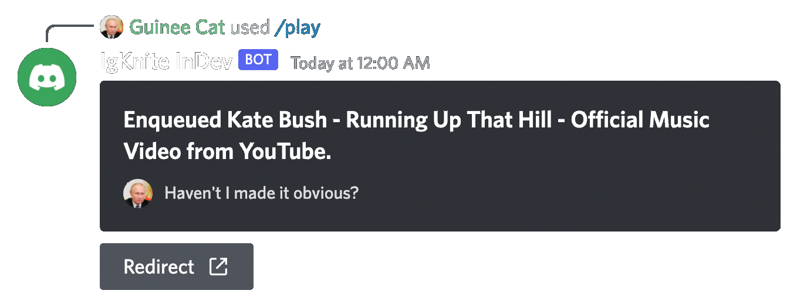

<div align="center">

<br>

<br>

# IgKnite

### The Swiss Army Knife for Moderation 🔪 Music on Discord


<a aria-label="Join the community on Discord" href="https://discord.gg/ftVPgrw54A" target="_blank">
    
</a>
<a aria-label="Inject to your Discord server" href="https://discord.com/api/oauth2/authorize?client_id=1016637486702792735&permissions=1505385246135&scope=bot%20applications.commands" target="_blank">
    
</a>

<br><br>

<br><br>

</div>

## ⚔️ Motive

Most Discord bots require a prefix (textual commands) and a clear head to use their commands. This can be intimidating at times, especially if you embarrass yourself in front of your friends by entering a command that isn't perfect. 

IgKnite, a Discord moderation and music bot built entirely on interactions such as slashes, buttons, views, selects, colors, and a slew of unique instructions, was created specifically for this purpose!

Despite its youth, IgKnite intends to grow alongside the community, focusing on the needs of the user base and adding anything that brings the user experience one step closer to being as fluid as possible. It also aims to reduce the overhead of using commands, allowing you to accomplish much more with a single interaction. <br>

## 🗡 Features

- Application-first command handler with slash, user and message commands.
- Asynchronous code on top of the [disnake](https://github.com/DisnakeDev/disnake) API wrapper.
- A playground all by itself for creative commands.
- Fully open-source (including assets).
- No buzz, all buff! <br>

## 🪶 How to use?

In order to learn about everything; from adding IgKnite to your Discord server to using its commands to even self-hosting it on your machine, kindly visit [the official documentation page](https://igknitedev.github.io/docs) and have a go-through! <br>

## 📓 Contributing

If you'd like to add your own features to this project, consider having a look at the [contribution guidelines.](./CONTRIBUTING.md) It contains all the critical information for you to hack and deploy! The official documentation for IgKnite, as hyperlinked in the previous section, also has similar text (possibly more) written within to help you understand the core functionalities of the project. We're eagerly waiting for your contribution! :D <br>

## Written with ❤️ in pure Python!

```
MIT License

Copyright (c) 2022 IgKnite

Permission is hereby granted, free of charge, to any person obtaining a copy
of this software and associated documentation files (the "Software"), to deal
in the Software without restriction, including without limitation the rights
to use, copy, modify, merge, publish, distribute, sublicense, and/or sell
copies of the Software, and to permit persons to whom the Software is
furnished to do so, subject to the following conditions:

The above copyright notice and this permission notice shall be included in all
copies or substantial portions of the Software.

THE SOFTWARE IS PROVIDED "AS IS", WITHOUT WARRANTY OF ANY KIND, EXPRESS OR
IMPLIED, INCLUDING BUT NOT LIMITED TO THE WARRANTIES OF MERCHANTABILITY,
FITNESS FOR A PARTICULAR PURPOSE AND NONINFRINGEMENT. IN NO EVENT SHALL THE
AUTHORS OR COPYRIGHT HOLDERS BE LIABLE FOR ANY CLAIM, DAMAGES OR OTHER
LIABILITY, WHETHER IN AN ACTION OF CONTRACT, TORT OR OTHERWISE, ARISING FROM,
OUT OF OR IN CONNECTION WITH THE SOFTWARE OR THE USE OR OTHER DEALINGS IN THE
SOFTWARE.
```

This project has been licensed under the [MIT License](LICENSE).